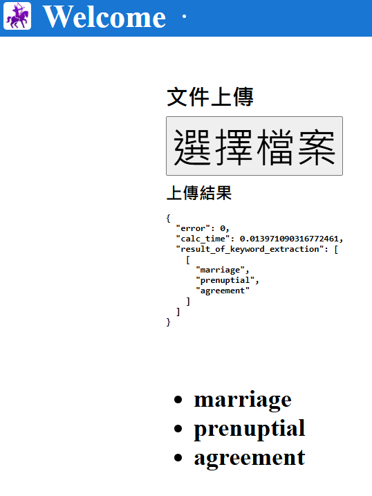

# ClientAppKeyWord 


## ENV SETTING

```
$ node -v    
```

> [!NOTE]
>
> node js v14.21.3

```
$ ng version
```

> [!NOTE]
>
> Angular CLI: 14.2.13
> Node: 14.21.3
> Package Manager: npm 6.14.18
> OS: win32 x64


## SETUP NG INSTANCE

npx @angular/cli@14.2.13 new ClientAppDevEx --routing

帶最新版devextreme-cli的實例安裝

REQUIRED : 

npx: installed 276 in 22.7s
Node.js version v14.21.3 detected.
The Angular CLI requires a minimum of v16.13.

```

$ npm install devextreme@21.1 devextreme-angular@21.1 --save --save-exact
```

```
$ npx devextreme-cli@21.1 new angular-app ClientAppDevEx
```

## Npm Run Start

​		    **必須啟動 Python API**


 


## NODJS DEMO

### 操作錄像 **[NODEJS_OPERATION_FLOW.mp4](NODEJS_OPERATION_FLOW.mp4)**   



 

