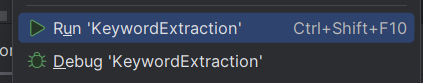

# Keyword Extraction Notes

## Upload Plate Detect

http://localhost:5600/detect

## Config Virtual Environment

​	check the python version installation

​	$ python —version

​	$ pip —version

## Install Package

pip install -r requirements.txt

## Detect Text File

http://localhost:5600/detect 

## Clear Files 

http://localhost:5600/clean

 

## Download The Specified File

http://localhost:5600/download/{filename}

## Run App

C:\Users\tonylaw\AppData\Local\Programs\Python\

python KeywordExtraction.py 

Right Click

 

OR C:\ProgramData\anaconda3\python.exe D:\CPPX_XXX\DOC_PRO_COMPANY\KeyWorkExtraction\KeywordExtraction.py 